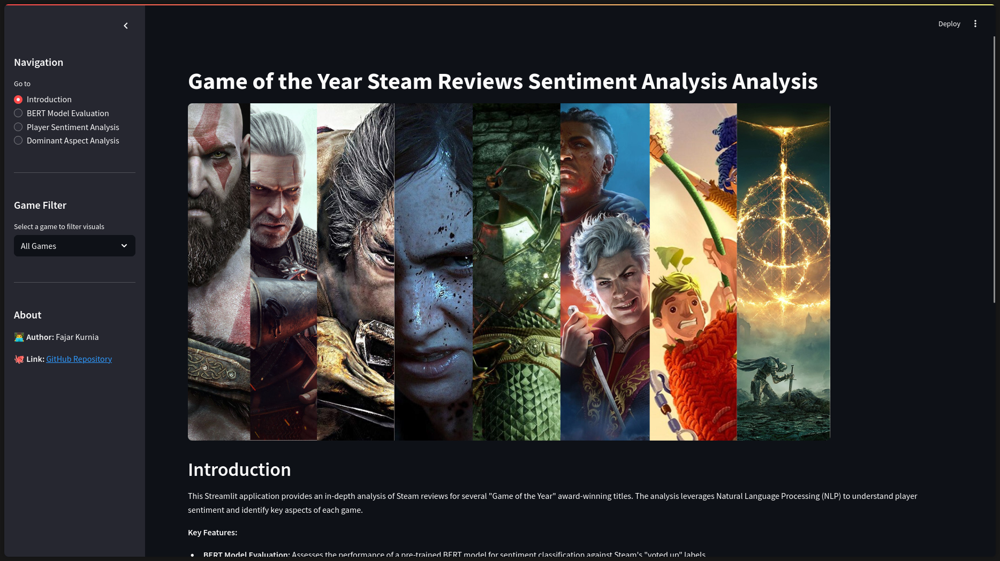

# 🏆 Game of the Year - Steam Review Analysis

An interactive Streamlit dashboard for analyzing player sentiment and key discussion topics from Steam reviews of Game of the Year award-winning titles.

---

### ✨ [Link to the Live Application](https://goty-sentiment-analysis.streamlit.app/) 

---

### Features
- **Interactive Filtering:** Filter data by game title and review year.
- **Sentiment Analysis:** Visualize overall sentiment scores and trends over time.
- **Aspect Analysis:** Discover what players talk about most (Graphics, Gameplay, Story, etc.) using interactive heatmaps and bar charts.
- **Model Evaluation:** See the performance of the BERT sentiment model used for the analysis.

### Screenshot
 


### How to Run Locally
1.  Clone the repository:
    ```bash
    git clone https://github.com/Fakur19/goty-streamlit-app
    cd goty-streamlit-app
    ```
2.  Install the required packages:
    ```bash
    pip install -r requirements.txt
    ```
3.  Set up your AWS credentials in a `.streamlit/secrets.toml` file.
4.  Run the Streamlit app:
    ```bash
    streamlit run app.py
    ```